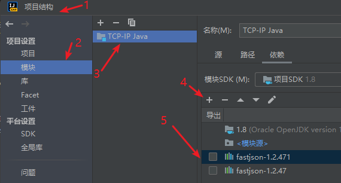
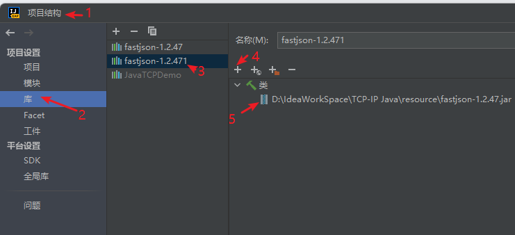
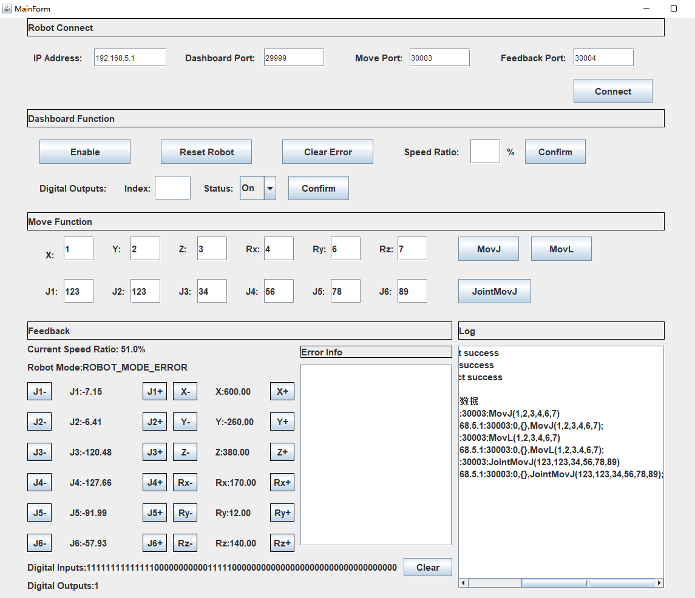

Chinese version of the README -> please [click here](./README.md)

# Readme

## 1. The following steps are required to run Demo
1. The computer can be connected to the network port of the controller with a network cable, and then set a fixed IP, which is in the same network segment as the controller IP. The controller can also be connected wirelessly.

    - Four-axis robots (such as MG400, etc.) When wired connection is connected to LAN1: ip is 192.168.1.6, when wired connection is connected to LAN2: ip is 192.168.2.6, wireless connection: ip is 192.168.9.1 .
    - Six-axis robot (such as CR series, etc.) Wired connection: ip is 192.168.5.1 ,Wireless connection: ip is 192.168.1.6 .

2. Try to ping the controller IP to make sure it is in the same network segment.

## 2. File description
1. Demo.java: entry for program operation.

2. Dashboard.java DobotMove.java Feedback.java ：according to the robot TCP / IP remote control scheme（ https://github.com/Dobot-Arm/TCP-IP-Protocol ）self modification.

## 3. Run Demo
1、you need to run the TCP-IP java project in IntelliJ idea.

  

2、you need to configure fastjson-1.2.47 in the resource directory jar.

  

3、Main interface after demo running：  

## 4. Test environment
- language:   
java version "1.8.0_202"  
Java(TM) SE Runtime Environment (build 1.8.0_202-b08)  
Java HotSpot(TM) 64-Bit Server VM (build 25.202-b08, mixed mode)
- os: Windows 10 64-bit

## 5. Controller version
The controller versions that can use the TCP/IP protocol are as follows:

- CR: 3.5.2 and above