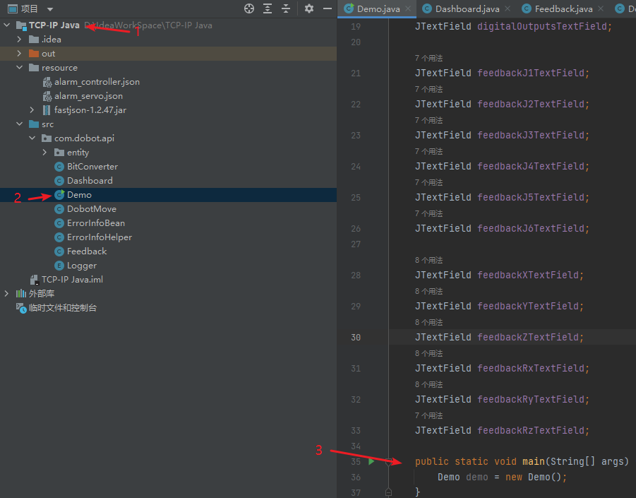
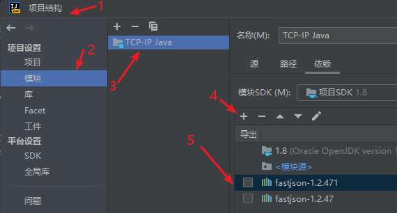
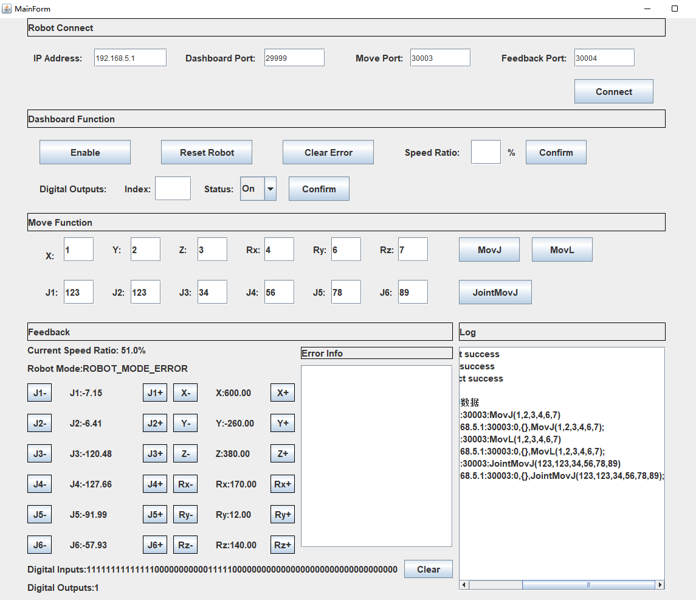

English version of the README -> please [click here](./README-EN.md)

# 先读我

## 1. 运行 Demo 需以下步骤
1. 电脑可用网线连接控制器的网口，然后设置固定 IP，与控制器 IP 在同一网段下。也可无线连接控制器。

   - 四轴机器人（如MG400等）     有线连接时连接LAN1：ip为192.168.1.6 , 有线连接时连接LAN2：ip为192.168.2.6,  无线连接：ip为192.168.9.1
   - 六轴机器人（如CR系列等）    有线连接：ip为192.168.5.1 , 无线连接：ip为192.168.1.6
  
2. 尝试 ping 通控制器 IP，确保在同一网段下。

## 2. 文件说明
1. Demo.java: 程序运行入口。  

2. Dashboard.java DobotMove.java Feedback.java ：根据机器人TCP/IP远程控制方案（https://github.com/Dobot-Arm/TCP-IP-Protocol）自行修改。

## 3. 运行Demo
1、需在IntelliJ IDEA 运行TCP-IP Java项目。  

  

2、需配置Resource目录下的fastjson-1.2.47.jar。

  

3、Demo运行后的主界面：  

## 4. 测试环境
- language:   
java version "1.8.0_202"  
Java(TM) SE Runtime Environment (build 1.8.0_202-b08)  
Java HotSpot(TM) 64-Bit Server VM (build 25.202-b08, mixed mode)
- os: Windows 10 64-bit

## 5.控制器版本
可以使用TCP/IP协议的控制器版本如下：  

- CR： 3.5.2 及以上

